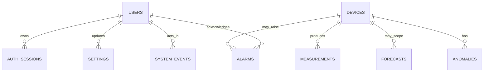

# System Architecture

## Scope and authority

This document describes the implemented monitoring and advisory subsystem. The
controlling build specification, accepted architecture decision records (ADRs),
generated OpenAPI document, SQLAlchemy models, and Alembic migrations remain the
contract authorities. A change to a fixed route, field, unit, calculation,
permission, or safety boundary requires a coordinated ADR and tests.

No component in this architecture can send a real load-control command.

## System context

```text
                         monitoring data only
  deterministic simulator -------------------------+
                                                      |
  future Pi gateway -- authenticated JSON/HTTP ------+---> FastAPI
                                                            |
                                                            v
                                                       PostgreSQL
                                                            |
                             authoritative REST <-----------+
                             advisory WebSocket <-----------+
                                      |
                                      v
                            React operator dashboard
```

The deterministic simulator is the implemented source. A hardware gateway and
trained ML service are integration points, not implemented evidence. The
dashboard is not a control system and is not billing-grade metering software.

## Runtime components and responsibilities

| Component | Responsibility | Explicitly does not do |
|---|---|---|
| React/TypeScript | Route protection, user interaction, formatting, charts, filters, explicit loading/error/empty/stale states | Query PostgreSQL, calculate authoritative KPIs, or control loads |
| Nginx | Serve the built SPA and proxy health, REST, and WebSocket traffic to the API | Expose PostgreSQL or implement authentication/business rules |
| FastAPI routes | Authenticate, validate inputs, invoke services, return typed schemas | Contain SQL queries or duplicate engineering formulas |
| Services | Ingestion rules, calculations, audit events, settings validation, and live-event publication | Treat WebSocket state as durable truth |
| Repositories | Bounded, parameterised database reads and writes | Decide presentation or role policy |
| PostgreSQL | Durable measurements, forecasts, anomalies, alarms, settings, users, sessions, and audit events | Serve the browser directly |
| Alembic | Version the schema from zero through current head `0003` | Create default login credentials |
| Simulator | Generate deterministic records through the fixed domain contracts | Claim sensor, gateway, or trained-model accuracy |

## Application data flow

### Measurement ingestion

1. A simulator or future gateway submits at most 60 records to
   `POST /api/v1/ingest/measurements` with `X-Ingest-Key`.
2. Pydantic validates shape, units, time awareness, hard ranges, quality, and
   explicit cumulative-meter reset metadata.
3. The ingestion service resolves the stable device code and processes each
   record independently. One invalid record does not relabel another.
4. PostgreSQL prevents duplicate `(device_id, measured_at)` rows. A duplicate
   is reported, not inserted a second time.
5. `last_seen_at` and relevant audit/system events are updated in the committed
   transaction.
6. Only after commit, the live manager may publish coalesced
   `measurement.new` and `device.status` notifications.

### Dashboard read

1. An authenticated browser requests a versioned `/api/v1` REST resource.
2. Repositories issue bounded queries; services apply the documented status,
   energy, demand, peak, comparison, completeness, and cost rules.
3. FastAPI returns a typed response generated into the frontend API types.
4. React formats returned values and renders data-quality state. It does not
   silently turn missing values into zero or recompute an authoritative KPI.

### Live update and recovery

1. The authenticated browser subscribes to `/api/v1/ws/live`.
2. Events carry `type`, UTC `emitted_at`, a monotonic process sequence, and a
   payload. Measurements are coalesced to at most one event per device/second.
3. The browser marks the connection `Reconnecting` after closure or heartbeat
   timeout and retries with exponential backoff capped at 30 seconds.
4. Reconnect or a sequence gap invalidates active queries and refetches REST.
   PostgreSQL and REST therefore remain the recovery source of truth.

The in-process connection manager intentionally matches the single-worker Pi
deployment. Multiple API workers would require a shared event broker and global
sequence allocation.

## Calculation boundary

All engineering values that influence cards or decisions are calculated in
backend services:

- current demand excludes disabled, stale, offline, and unusable values;
- cumulative energy is segmented at explicit resets and never subtracts across
  a reset;
- demand is a time-weighted mean over the configured interval, not a maximum
  instantaneous sample;
- a peak interval must meet the accepted 90% completeness threshold;
- previous-period comparisons use equal elapsed local-time intervals;
- cost is a Decimal energy calculation using the flat ZAR tariff and is labelled
  an estimate;
- gaps reduce completeness rather than becoming zero or hidden interpolation.

React may combine aligned history buckets for a chart display, but it may not
create a competing KPI, energy, or peak calculation. Detailed meanings are in
the [data dictionary](data-dictionary.md) and ADR-004/ADR-008.

## Persistence model



High-volume measurement and forecast rows use BIGSERIAL identifiers; user-facing
entities use UUIDs. Every stored timestamp is timezone-aware PostgreSQL
`TIMESTAMPTZ`; API timestamps serialize as ISO 8601 UTC. Missing measurements
use nullable values plus data quality, never a numeric sentinel.

## Security and trust boundaries

```text
untrusted browser input
  -> Nginx request-size and routing boundary
  -> FastAPI session, role, schema, rate, and business validation
  -> parameterised SQLAlchemy access

machine producer
  -> separate X-Ingest-Key boundary
  -> per-record validation and database constraints
```

- Browser passwords are Argon2id-hashed; opaque session tokens are stored only
  as SHA-256 hashes and sent in an HttpOnly, SameSite=Strict cookie.
- Cookie transport security is explicit. Local/LAN HTTP deployments set
  `SESSION_COOKIE_SECURE=false`; deployments behind verified HTTPS/TLS must set
  it to `true`. The supplied Nginx configuration does **not** terminate TLS.
- Viewer, operator, and admin form an ordered role boundary. Operators/admins
  acknowledge alarms; only admins edit devices/settings. No role controls loads.
- Gateway ingestion has its own secret and never reuses a browser credential.
- Login is rate-limited to 10 attempts/minute and ingestion to 120
  requests/minute per client; request IDs and immutable audit events support
  tracing.
- Secrets and database contents remain outside Git and images.

## Environment profiles

| Profile | Source and purpose |
|---|---|
| `development` | Deterministic simulator, host-bound developer ports, OpenAPI UI |
| `demo` | Reproducible scripted simulator scenarios and screenshots |
| `gateway` | Authenticated machine ingestion on the target LAN |
| `test` | Isolated test data; never production/development records |

Changing a profile does not change the public measurement, forecast, anomaly,
REST, or WebSocket contracts.

## Raspberry Pi production topology

```text
private-LAN browser
  -> Pi private address:8080 (only published service)
  -> Nginx static React site and reverse proxy
       -> FastAPI:8000 (internal Docker network only)
            -> PostgreSQL:5432 (internal Docker network only)
                 -> named postgres_data volume
```

`infra/docker-compose.pi.yml` requires one exact private `LAN_BIND_ADDRESS`.
FastAPI and PostgreSQL have no host ports; the backend Docker network is
internal. Database, API, and web have health checks, `unless-stopped` restart
policies, bounded JSON logs, init processes, explicit stop grace periods, and
`no-new-privileges`. API/web filesystems are read-only apart from named `tmpfs`
mounts; the API image runs as non-root `10001:10001`.

The API and web images use multi-stage builds and ARM64-capable bases. React is
built once and served by Nginx. GitHub Actions may publish the two images to
GHCR, but the Pi remains the runtime host and PostgreSQL volume owner.

The default Pi route is private-LAN HTTP, not HTTPS. It must not be exposed to
the public internet. TLS, remote access, and certificate lifecycle are future
deployment work; see [limitations](limitations.md).

## Failure behaviour and recovery

| Failure | User/system behaviour |
|---|---|
| Missing/stale device sample | Explicit stale/offline status; excluded from current demand rather than shown as live zero |
| API unavailable | Error panel/retry state; no fabricated values |
| WebSocket interruption/gap | Visible reconnect state followed by REST refetch |
| Database unavailable or behind migration | `/ready` fails; process-only `/health` remains distinct |
| Duplicate ingest retry | Existing row retained; duplicate reported in the 202 result |
| Container/host restart | Restart policy and PostgreSQL recovery; readiness gates dependent services |
| Restore/upgrade concern | Guarded backup, clean-volume restore, integrity check, and recovery-first rollback runbook |

Local restore/crash/restart rehearsals passed, but clean Pi reboot and physical
power-loss validation remain pending. See [operations](operations.md) and the
[physical Pi checklist](test-evidence/step-15-pi-hardware-checklist.md).

## Contract and evidence map

- Requirements and verification: [requirements](requirements.md),
  [acceptance matrix](acceptance-matrix.md), and
  [final traceability](final-requirements-traceability.md)
- Stable external interfaces: [API contract](api-contract.md) and
  `apps/api/openapi.json`
- Data meaning and formulas: [data dictionary](data-dictionary.md)
- Rationale/trade-offs: [decision index](decisions/README.md)
- Deployment/recovery: [operations runbook](operations.md)
- Known gaps: [limitations](limitations.md)
